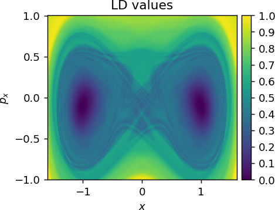

## Statement of Need

Nonlinear dynamical systems are ubiquitous in natural and engineering sciences, for example, fluid mechanics, theoretical chemistry, ship dynamics, rigid body dynamics, atomic physics, solid mechanics, condensed matter physics, mathematical biology, oceanography, meteorology, celestial mechanics [see @wiggins1994normally for a list of collated references]. There has been many advances in understanding phenomena across these disciplines using the geometric viewpoint of the solutions and the underlying structures in the phase space. Chief among these phase space structures are the invariant manifolds that form a barrier between dynamically distinct solutions. In most nonlinear systems, the invariant manifolds are computed using numerical techniques that rely on some form of linearization around equilibrium points followed by continuation and globalization. However, these methods become computationally expensive and challenging when applied to the high-dimensional phase space of chemical reactions or vector fields defined using numerical simulation or experimental data. This points to the need for techniques that can be paired with trajectory calculations, without excessive computational overhead and at the same time can be visualized along with trajectory data. The Python package, `LDDS`, serves this need for analyzing deterministic and stochastic, continuous and discrete high-dimensional nonlinear dynamical systems described either by an analytical vector field or a trajectory data obtained from numerical simulations or experiments.

To the best of our knowledge, no other software for calculating Lagrangian descriptors exists. A variety of computational tools is available for competing approaches popular in fluid mechanics, such as the identification of Lagrangian coherent structures via finite-time Lyapunov exponents [@lagrangian], [@dgftle], [@lcstool], [@libcfd2lcs], [@lcsmatlabkit], [@activeBarriers] and finite-size Lyapunov exponents [@lagrangian] or Eulerian coherent structures [@barriertool].

## Summary and Functionalities

The `LDDS` software is a Python-based module that provides the user with the capability of analyzing the phase space structures of both continuous and discrete nonlinear dynamical systems in the deterministic and stochastic settings by means of the method of Lagrangian descriptors (LDs). The main idea behind this methodology is to define a scalar function, a Lagrangian desccriptor, that accumulates the values taken by a positive function of the phase space variables of the system along the trajectory starting from a given initial condition. This operation is carried out in forward and backward time for all initial conditions on a predefined grid, and the output obtained from the method provides an indicator of the underlying geometry of the phase space of the dynamical system under study. One of the main goals we pursue with this software is to give te tools for reproducible scientific research.

This open-source package incorporates the following features:

* Analysis of two-dimensional maps wth LDs.
* Study of the phase space structure of two-dimensional continuous dynamical systems with LDs.
* Calculation of LDs for a system of two stochastic differential equations with additive noise.
* Computation of LDs on two-dimensional phase space planes for Hamiltonian systems with 2 or more degrees of freedom (DoF).
* Application of LDs to Hamiltonian systems with 2 DoF where the potential energy surface is known on a discrete spatial grid.
* Computation of LDs from a spatio-temporal discretization of a two-dimensional time-dependent vector field.
* Extraction of the invariant stable and unstable manifolds from the LD scalar field values.
* Addition to time-dependent external forcings for two-dimensional continuous dynamical systems.
* Different definitions for the Lagrangian descriptor function found in the literature.

All the different features of the module, and their usage, are illustrated with examples included in the form of Jupyter notebooks. These interactive tutorials would help the user better understand how to set up a model dynamical system to which LDs is applied, and present him/her with different options for visualizing the results obtained from the analysis. We believe that these resources provide useful material towards the development of an effective learning process that could motivate the integration of this tool into his/her research/academic projects. Moreover, this will surely encourage future contributions from the scientific community in order to extend the features and applicability of this software package to other areas. 

### Example systems {#examples}

The following dynamical systems are included in this software package as examples to illustrate the application of Lagrangian descriptors:

#### Maps:

* Standard map 

* Hénon map

#### Flows:

Two-dimensional phase space:

* Hamiltonian center (Forced/Unforced)..
* Hamiltonian saddle (Forced/Unforced)..
* Undamped Duffing oscillator (Forced/Unforced).

* Saddle-node Hamiltonian (Forced/Unforced)..
* Double-gyre flow.

Four dimensional phase space:

* Saddle-center Hamiltonian.
* Hénon-Heiles Hamiltonian.

Six dimensional phase space:

* Saddle-center-center Hamiltonian.

## Relation to ongoing research projects

Lagrangian descriptors form the basis of a number of past and present research projects [cite]. The common theme of all these projects is the investigation of phase space structures that govern phase space transport in nonlinear dynamical systems. We have also co-authored an open-source book project using Jupyter book [@jupyterbook_2020] on the theory and applications of Lagrangian descriptors [@ldbook2020]. This open-source package is the computational companion to that book.

## Acknowledgements

We acknowledge the support of EPSRC Grant No. EP/P021123/1 and Office of Naval Research (Grant No. N00014-01-1-0769). 

## References

